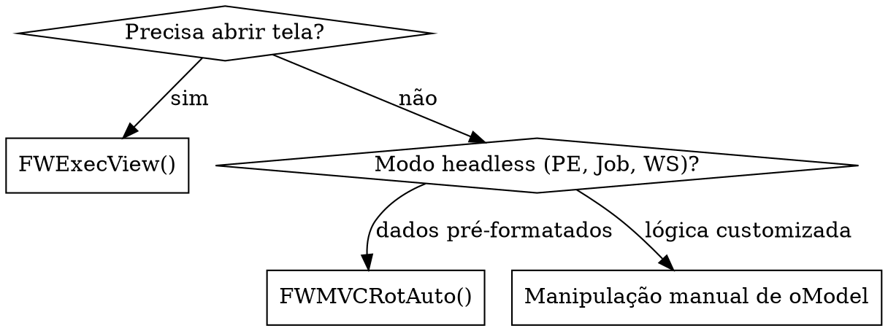

# advpl-mvc — Framework MVC do Protheus

A partir do release 11 da TOTVS, cadastros e processos no Protheus usam o framework **MVC** (FWMVC). O padrão legado `AxCadastro`/`Modelo2`/`Modelo3` é deprecado (catalogado como `MOD-004` no lint).

Uma rotina MVC tem **3 funções estáticas obrigatórias** + um menu:

- `MenuDef()` → retorna `aRotina` (entradas de menu, ações disponíveis).
- `ModelDef()` → retorna `oModel` (estrutura de dados, validações, hooks).
- `ViewDef()` → retorna `oView` (interface gráfica, vinculação ao model).

## Quando usar

- Criar/editar cadastro Protheus (CRUD) — sempre MVC pra código novo.
- Adicionar validação a cadastro existente (via PE `<Rotina>MOD` ou InstallEvent).
- Trabalhar com sub-models (cabeçalho/itens, ex: pedido + itens).
- Refatorar `AxCadastro`/`Modelo2`/`Modelo3` legado (`MOD-004`).
- Edit em arquivo MVC identificado por `/plugadvpl:tables` ou `/plugadvpl:arch`.

## Estrutura mínima moderna (TLPP-style)

```advpl
#include "TOTVS.CH"
#include "FWMVCDef.CH"

User Function XYZCAD()
    Local oBrowse := FWMBrowse():New()
    oBrowse:SetAlias("ZZZ")
    oBrowse:SetMenuDef("XYZCAD")        // referencia a propria MenuDef
    oBrowse:SetDescription("Cadastro XYZ")
    oBrowse:Activate()
Return Nil

Static Function MenuDef()
    Return FWMVCMenu("XYZCAD")          // gera aRotina padrao (View/Insert/Update/Delete/Print/Copy)
End

Static Function ModelDef()
    Local oModel    := MPFormModel():New("XYZCADMD")   // 5 params; hoje passa só cIDModel
    Local oStruZZZ  := FWFormStruct(1, "ZZZ")           // estrutura pra MODEL

    oModel:AddFields("ZZZMASTER", /*parent*/, oStruZZZ)
    oModel:GetModel("ZZZMASTER"):SetPrimaryKey({"ZZZ_FILIAL", "ZZZ_COD"})

    // Hooks MODERNOS via FWModelEvent (substitui bCommit/bTudoOk):
    oModel:InstallEvent("EVT_XYZ", /*owner*/, zEventXYZ():New(oModel))
Return oModel

Static Function ViewDef()
    Local oModel   := FWLoadModel("XYZCAD")             // reaproveita o model
    Local oView    := FWFormView():New()
    Local oStruZZZ := FWFormStruct(2, "ZZZ")            // estrutura pra VIEW

    oView:SetModel(oModel)
    oView:AddField("VIEW_ZZZ", oStruZZZ, "ZZZMASTER")
    oView:CreateHorizontalBox("PRINCIPAL", 100)
    oView:SetOwnerView("VIEW_ZZZ", "PRINCIPAL")
Return oView
```

## `MPFormModel():New()` — assinatura canônica

```advpl
MPFormModel():New(cIDModel, bPreValidacao, bPosValidacao, bCommit, bCancel)
```

| # | Parâmetro       | Hoje (recomendação TOTVS)               |
|---|-----------------|------------------------------------------|
| 1 | `cIDModel`      | **Obrigatório** — ID do model           |
| 2 | `bPreValidacao` | **Não usar** — registre via InstallEvent |
| 3 | `bPosValidacao` | **Não usar** — registre via InstallEvent (era o "bTudoOk") |
| 4 | `bCommit`       | **Descontinuado** — usar `AfterTTS` do FWModelEvent |
| 5 | `bCancel`       | **Não usar** — registre via InstallEvent |

> **Importante:** o legado mostra MPFormModel():New("ID", , bTudoOk, bCommit). Esse pattern **ainda funciona** mas é flagged em Code Analysis TOTVS. Para código novo, use **InstallEvent**.

## `FWModelEvent` + `InstallEvent()` — hooks modernos

Substitui `bCommit`/`bTudoOk`/`bPreValidacao`/`bPosValidacao`/`bCancel`. Padrão recomendado pela TOTVS para customização sem alterar fontes padrão.

```advpl
// 1. Define classe herdando de FWModelEvent
Class zEventXYZ From FWModelEvent
    Method New() CONSTRUCTOR
    Method BeforeTTS()     // antes do BEGIN TRANSACTION
    Method InTTS()         // dentro da transação (gravações auxiliares)
    Method AfterTTS()      // depois do END TRANSACTION (notificações)
EndClass

Method New(oModel) Class zEventXYZ
    // construtor — pode armazenar referencia ao oModel
Return Self

Method BeforeTTS(oModel) Class zEventXYZ
    // Ex: bloquear operacao em horario nao permitido
    // Local lOk := Time() >= "08:00" .And. Time() <= "18:00"
    // If !lOk; Help(...); Return .F.; EndIf
Return .T.

Method InTTS(oModel) Class zEventXYZ
    // Ex: gravar log de auditoria na ZZL durante a transacao
    Local cCod := oModel:GetValue("ZZZMASTER", "ZZZ_COD")
    DbSelectArea("ZZL")
    RecLock("ZZL", .T.)
    ZZL->ZZL_FILIAL := xFilial("ZZL")
    ZZL->ZZL_COD    := cCod
    ZZL->ZZL_DTHR   := FwTimeStamp()
    ZZL->(MsUnlock())
Return .T.

Method AfterTTS(oModel) Class zEventXYZ
    // Ex: enviar notificação após commit confirmado
    // (rede pode falhar aqui sem afetar transação)
    Return .T.
```

### Ordem de execução do FWModelEvent

```
SetVldActivate (model abre)
  ↓
[campos preenchidos]
  ↓
SetPreValidation / FwEvent BeforeTTS
  ↓
SetPosValidation
  ↓
[BEGIN TRANSACTION]
  ↓
  Gravação automática do framework
  ↓
  FwEvent InTTS  ← grave dados auxiliares aqui
  ↓
[END TRANSACTION]
  ↓
FwEvent AfterTTS  ← notificações/integrações aqui
  ↓
SetDeactivate (model fecha)
```

> **Versão mínima:** Protheus 12.1.17+. Em releases anteriores use `bCommit` direto.

## `aRotina` — formato canônico

Cada linha do `aRotina` é um array de **6 elementos** (legado: alguns padrões antigos usam 7º):

```advpl
{ cDescricao, cFuncao, nReservado, nOperacao, nAcesso, lPula }
```

| # | Elemento     | Conteúdo                                                |
|---|--------------|---------------------------------------------------------|
| 1 | `cDescricao` | Texto exibido no menu ("Pesquisar", "Incluir", etc.)    |
| 2 | `cFuncao`    | Função a invocar (ex: `"VIEWDEF.XYZCAD"`)               |
| 3 | `nReservado` | 0 (reservado)                                           |
| 4 | `nOperacao`  | Tipo (1=Pesquisar, 2=View, 3=Insert, 4=Update, 5=Delete, 8=Print, 9=Copy) |
| 5 | `nAcesso`    | Nível de acesso (0 = sempre disponível)                 |
| 6 | `lPula`      | `.F.` (não pula validação de acesso)                    |

### Forma manual (verbosa)

```advpl
Static Function MenuDef()
    Local aRotina := {}
    aAdd(aRotina, {"Pesquisar",  "AxPesqui",          0, 1, 0, .F.})
    aAdd(aRotina, {"Visualizar", "VIEWDEF.XYZCAD",    0, 2, 0, .F.})
    aAdd(aRotina, {"Incluir",    "VIEWDEF.XYZCAD",    0, 3, 0, .F.})
    aAdd(aRotina, {"Alterar",    "VIEWDEF.XYZCAD",    0, 4, 0, .F.})
    aAdd(aRotina, {"Excluir",    "VIEWDEF.XYZCAD",    0, 5, 0, .F.})
Return aRotina
```

### Forma compacta com `FWMVCMenu` (recomendada)

```advpl
Static Function MenuDef()
    Return FWMVCMenu("XYZCAD")   // gera Pesquisar/Visualizar/Incluir/Alterar/Excluir/Imprimir/Copiar
End
```

Quando precisar **customizar** (adicionar opção própria), pegue o padrão e modifique:

```advpl
Static Function MenuDef()
    Local aRotina := FWMVCMenu("XYZCAD")
    aAdd(aRotina, {"Aprovar",  "U_XYZAPROV", 0, 4, 0, .F.})  // opção extra
Return aRotina
End
```

### Constantes `MODEL_OPERATION_*`

| Operação    | Valor `aRotina` | Constante                       |
|-------------|-----------------|----------------------------------|
| Pesquisar   | 1               | —                                |
| Visualizar  | 2               | `MODEL_OPERATION_VIEW` (1)       |
| Incluir     | 3               | `MODEL_OPERATION_INSERT` (3)     |
| Alterar     | 4               | `MODEL_OPERATION_UPDATE` (4)     |
| Excluir     | 5               | `MODEL_OPERATION_DELETE` (5)     |
| Imprimir    | 8               | —                                |
| Copiar      | 9               | `MODEL_OPERATION_INSERT`         |

Em código (hooks, validações), **sempre use as constantes** em vez de números literais:

```advpl
If oModel:GetOperation() == MODEL_OPERATION_INSERT
    // só na inclusão
EndIf
```

## `FWFormStruct(1, alias)` × `FWFormStruct(2, alias)`

- `FWFormStruct(1, "ZZZ")` → estrutura para **MODEL** (campos, validações X3, gatilhos SX7, defaults SX3 INIT).
- `FWFormStruct(2, "ZZZ")` → estrutura para **VIEW** (apresentação, ordem visual, pastas SXA, agrupamentos).

A estrutura é lida do dicionário **SX3** (campos) + **SX7** (gatilhos) + **SXA** (pastas). Para ver/alterar embutidos, veja `[[advpl-dicionario-sx]]` e `[[advpl-dicionario-sx-validacoes]]`.

Customizações ad-hoc:

```advpl
oStruZZZ:RemoveField("ZZZ_INTERN")              // remove campo da estrutura
oStruZZZ:SetProperty("ZZZ_COD", MODEL_FIELD_NOUPD, .T.)  // bloqueia alteração
oStruZZZ:AddField(...)                          // adiciona campo virtual
```

## Sub-models — cabeçalho + grid de itens

Cadastros com cabeçalho + itens (ex: pedido de venda, transferência):

```advpl
Static Function ModelDef()
    Local oModel    := MPFormModel():New("XYZCADMD")
    Local oStruZZ1  := FWFormStruct(1, "ZZ1")    // cabeçalho
    Local oStruZZ2  := FWFormStruct(1, "ZZ2")    // itens

    // Cabeçalho (registro único)
    oModel:AddFields("ZZ1MASTER", /*parent*/, oStruZZ1)
    oModel:GetModel("ZZ1MASTER"):SetPrimaryKey({"ZZ1_FILIAL", "ZZ1_NUM"})

    // Itens (grid 1..N)
    oModel:AddGrid("ZZ2DETAIL", "ZZ1MASTER", oStruZZ2)
    oModel:SetRelation("ZZ2DETAIL", ;
        {{"ZZ2_FILIAL", "xFilial('ZZ2')"}, {"ZZ2_NUM", "ZZ1_NUM"}}, ;
        ZZ2->(IndexKey(1)))

    // Restrições da grid
    oModel:GetModel("ZZ2DETAIL"):SetUniqueLine({"ZZ2_ITEM"})       // ITEM não pode repetir
    // oModel:GetModel("ZZ2DETAIL"):SetOptional(.T.)               // grid pode ficar vazia
    // oModel:GetModel("ZZ2DETAIL"):SetNoInsertLine(.T.)           // grid read-only (só visualiza)
    // oModel:GetModel("ZZ2DETAIL"):SetNoDeleteLine(.T.)           // proíbe exclusão de linha existente
Return oModel
```

### Métodos de grid úteis

| Método                              | Efeito                                        |
|-------------------------------------|-----------------------------------------------|
| `SetUniqueLine({campos})`           | Combinação de campos não pode repetir         |
| `SetOptional(.T.)`                  | Grid pode ficar vazia (default = obrigatória) |
| `SetNoInsertLine(.T.)`              | Bloqueia adicionar nova linha                 |
| `SetNoDeleteLine(.T.)`              | Bloqueia deletar linha existente              |
| `SetMaxLine(N)` / `SetMinLine(N)`   | Limites de quantidade                         |
| `SetActivate({|oModel| ...})`       | Hook ao ativar a grid                         |

## `oModel:GetValue` vs `oModel:SetValue` vs `oModel:LoadValue`

| Método      | Disparam gatilhos? | Disparam validação? | Uso típico                              |
|-------------|--------------------|--------------------:|-----------------------------------------|
| `GetValue`  | (lê)               | —                   | Sempre que precisar do valor atual      |
| `SetValue`  | **Sim** (X7)       | **Sim** (X3_VALID)  | Default em código user-flow             |
| `LoadValue` | **Não**            | **Não**             | Carregar dados em PE/import sem cascata |

```advpl
// PE de inclusão automática: NÃO quer disparar gatilhos
oModel:LoadValue("ZZ1MASTER", "ZZ1_DESC", "Importado")

// User flow: QUER disparar gatilho que recalcula campos derivados
oModel:SetValue("ZZ1MASTER", "ZZ1_COD", cNovoCod)
```

## Abrir tela MVC: `FWExecView` (interativo) vs `FWMVCRotAuto` (headless)



### `FWExecView` — abre janela MVC interativa

```advpl
FWExecView("Inclusao de Cliente", "VIEWDEF.XYZCAD", MODEL_OPERATION_INSERT)
```

### `FWMVCRotAuto` — executa headless (lote, WS, PE)

```advpl
User Function ZBatch()
    Local oModel := Nil
    Local aDados := {}
    Private aRotina      := StaticCall(XYZCAD, MenuDef)
    Private lMsErroAuto  := .F.

    oModel := StaticCall(XYZCAD, ModelDef)

    aAdd(aDados, {"ZZZ_COD",  "000001", Nil})
    aAdd(aDados, {"ZZZ_NOME", "Cliente Teste", Nil})

    FWMVCRotAuto(oModel, "ZZZ", MODEL_OPERATION_INSERT, {{"ZZZMASTER", aDados}})

    If lMsErroAuto
        MostraErro()
    Else
        MsgInfo("Incluido!", "OK")
    EndIf
Return
```

**Para grid (sub-models)**:

```advpl
Local aCab := {}
Local aItens := {}

aAdd(aCab, {"ZZ1_NUM", "PED001", Nil})

// Grid: array de arrays — cada array é uma linha
aAdd(aItens, {{"ZZ2_ITEM", "01", Nil}, {"ZZ2_PROD", "P001", Nil}})
aAdd(aItens, {{"ZZ2_ITEM", "02", Nil}, {"ZZ2_PROD", "P002", Nil}})

FWMVCRotAuto(oModel, "ZZ1", MODEL_OPERATION_INSERT, ;
    {{"ZZ1MASTER", aCab}, {"ZZ2DETAIL", aItens}})
```

## Anti-padrões

- **`RecLock` dentro de `bCommit` legado** → registro fica preso se erro entre RecLock e MsUnlock. Use `FWModelEvent.InTTS` com try-protected.
- **Hook lento** (`bPosValidacao`/`AfterTTS` fazendo query pesada cross-banco) → trava UX do usuário ou estoura timeout em REST.
- **Mutar `oModel` em `AfterTTS`** — transação já fechou, mudança não vai junto. Use `BeforeTTS` ou `InTTS`.
- **Cross-banco síncrono em `AfterTTS` sem `Begin Sequence`/`Recover`** → falha de rede mata o response final do user.
- **`AxCadastro`/`Modelo2`/`Modelo3` em código novo** → catalogado como `MOD-004`. Veja `[[advpl-refactoring]]` padrão 4.
- **Esquecer de retornar `oModel`/`oView`/`aRotina`** → erro de inicialização (NIL).
- **Passar bCommit no `MPFormModel():New()` direto** em código novo → Code Analysis acusa. Use InstallEvent.
- **Hook em `bCancel` chamando RecLock** → cancel deveria ser idempotente, sem gravação.

## Cross-references com outras skills

- `[[advpl-fundamentals]]` — User Function, Static Function, escopos, MV_PAR, reservadas.
- `[[advpl-mvc-avancado]]` — eventos avançados, FWFormCommit, FWFormFieldStruct customizada, multi-grid (pai/filho/neto).
- `[[advpl-pontos-entrada]]` — PEs `<Rotina>MOD`, `<Rotina>VLD`, `<Rotina>COMMIT` que injetam código sem alterar fonte TOTVS.
- `[[advpl-dicionario-sx]]` — estrutura SX3 (origem do FWFormStruct), SX7 (gatilhos), SXA (pastas).
- `[[advpl-dicionario-sx-validacoes]]` — X3_VALID, X3_INIT, X3_WHEN — expressões embutidas nos campos.
- `[[advpl-code-review]]` — regras BP-001 (RecLock), BP-002 (Transaction), MOD-004 (AxCadastro→MVC).
- `[[advpl-embedded-sql]]` — queries dentro de hooks (com `%xfilial%`, `%notDel%`).
- `[[plugadvpl-index-usage]]` — `/plugadvpl:find function ModelDef`, `/plugadvpl:callers <rotina>`.

## Referência rápida

| Função/método                          | Para que serve                                       |
|----------------------------------------|------------------------------------------------------|
| `MPFormModel():New(id, ...)`           | Cria model raiz (passe só `id`; resto via InstallEvent) |
| `FWMVCMenu("XYZCAD")`                  | Gera `aRotina` padrão automaticamente                 |
| `FWFormStruct(1, alias)`               | Estrutura para model                                  |
| `FWFormStruct(2, alias)`               | Estrutura para view                                   |
| `oModel:AddFields(id, parent, struct)` | Sub-model "form" (registro único)                     |
| `oModel:AddGrid(id, parent, struct)`   | Sub-model "grid" (1..N)                               |
| `oModel:SetRelation(child, aRel, idx)` | Vincula filho ao pai via chaves                       |
| `oModel:InstallEvent(id, owner, oEvt)` | Registra classe FWModelEvent (substitui bCommit)      |
| `oModel:GetOperation()`                | Retorna `MODEL_OPERATION_*`                           |
| `oModel:GetValue(submdl, campo)`       | Lê valor atual                                        |
| `oModel:SetValue(submdl, campo, val)`  | Escreve + dispara gatilhos                            |
| `oModel:LoadValue(submdl, campo, val)` | Escreve **sem** disparar gatilhos                     |
| `oModel:GetModel("ID")`                | Acessa sub-model (configurar SetUnique etc.)          |
| `FWLoadModel("XYZCAD")`                | Carrega model definido em outro fonte                 |
| `FWExecView(titulo, view, oper)`       | Abre tela MVC interativa                              |
| `FWMVCRotAuto(oModel, alias, op, aDados)` | Executa MVC headless (lote/WS/PE)                  |

## Comandos plugadvpl relacionados

- `/plugadvpl:find function ModelDef` — lista todas as `ModelDef` indexadas no projeto.
- `/plugadvpl:find function InstallEvent` — descobre quem usa FWModelEvent (vs bCommit).
- `/plugadvpl:callers <rotina>` — descobre quem aciona o cadastro.
- `/plugadvpl:tables <T>` — vê qual MVC usa a tabela.
- `/plugadvpl:lint <arq>` — checa `BP-001` (RecLock), `BP-002` (Transaction), `MOD-004` (AxCadastro).
- `/plugadvpl:impacto <campo>` — cruza X3_VALID/X7_REGRA com fontes MVC.

## Referência profunda

Para detalhes (~2.3k linhas), consulte [`reference.md`](reference.md) ao lado deste arquivo:

- Anatomia completa de `MPFormModel`/`MPFormFields`/`MPFormGrid` com propriedades.
- Tabela de métodos de `oModel`/`oView` (LoadValue, SetUniqueLine, SetOptional, SetNoInsertLine, SetDescription).
- Eventos do ciclo de vida MVC e ordem de execução.
- Padrões pra grids dependentes (pai/filho/neto) com `SetRelation` e `SetUniqueLine`.
- Integração com FWMBrowse, MarkBrowse e MsDialog para casos custom.

## Exemplos práticos

Veja a pasta [`exemplos/`](exemplos/) ao lado deste SKILL.md para fontes reais TLPP de produção:

- `custom.mvc.customers.tlpp` — cadastro com FWMBrowse + namespace TLPP.
- `custom.mvc.monitors.tlpp` — monitor genérico de processos de integração.
- `custom.mvc.quote.tlpp` — cotação com cabeçalho + grid (sub-models).
- `custom.mvc.transferOrder.tlpp` — ordem de transferência com validações cruzadas.
- `custom.mvc.confirmationOfReceipt.tlpp` — confirmação com hooks de commit.

## Sources

- [Interceptação do Commit e Validação MVC - FWModelEvent - TDN](https://tdn.totvs.com/pages/viewpage.action?pageId=269552294)
- [Como utilizar a FWModelEvent no lugar do Commit - Terminal de Informação](https://terminaldeinformacao.com/2023/03/24/como-utilizar-a-fwmodelevent-no-lugar-do-commit-em-uma-rotina-mvc/)
- [Exemplo de rotina automática para aplicações MVC - TDN](https://tdn.totvs.com/pages/viewpage.action?pageId=6814842)
- [FWMVCRotAuto - Maratona AdvPL TL++ 237](https://terminaldeinformacao.com/2024/02/15/disparando-uma-execucao-automatica-atraves-da-fwmvcrotauto-maratona-advpl-e-tl-237/)
- [FWExecView - Maratona AdvPL TL++ 216](https://terminaldeinformacao.com/2024/02/05/abrindo-uma-tela-mvc-com-fwexecview-maratona-advpl-e-tl-216/)
- [ADVPL MVC Comandos - Universo do Desenvolvedor](https://udesenv.com.br/post/advpl-mvc-comandos)
- [Dominando MVC AdvPL - Juliane Venteu (GitHub)](https://github.com/julianeventeu/Dominando-MVC-AdvPL)
- [Validação no bloco de commit - TOTVS Central](https://centraldeatendimento.totvs.com/hc/pt-br/articles/360020326232)
- [MVC V12 - Central Protheus PDF](https://centralprotheus.com.br/wp-content/uploads/2023/12/ADVPL-MVC.pdf)
- [Exemplo rotina automatica zRotAuto.prw - dan-atilio/AdvPL](https://github.com/dan-atilio/AdvPL/blob/master/Exemplos/V%C3%ADdeo%20Aulas/024%20-%20Rotinas%20autom%C3%A1ticas%20em%20MVC/zRotAuto.prw)
